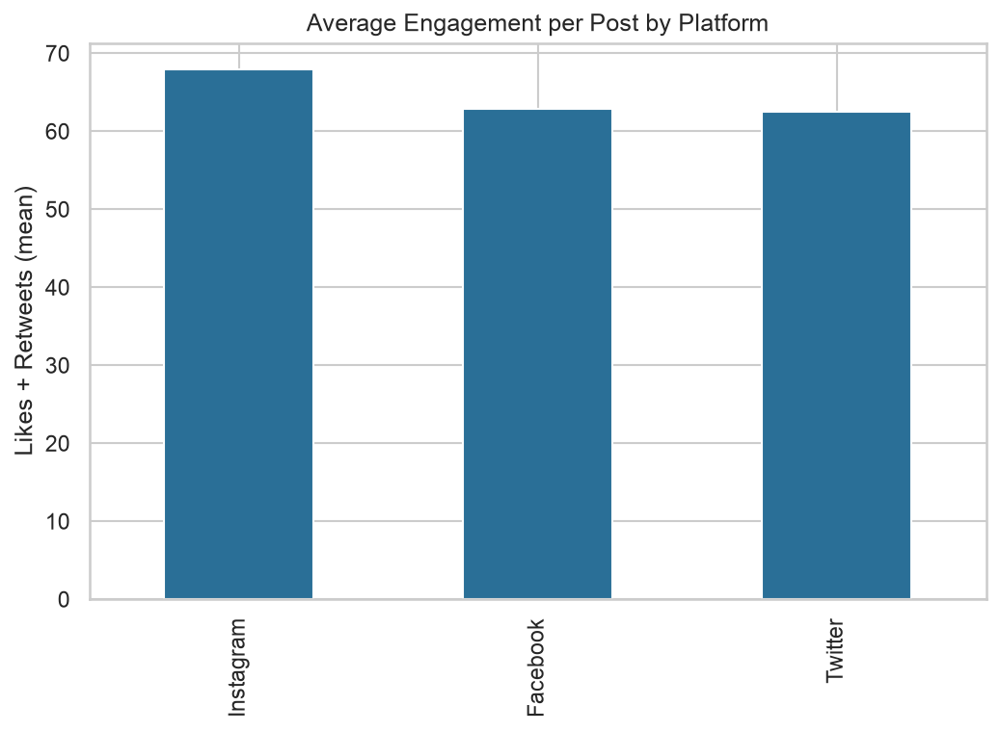
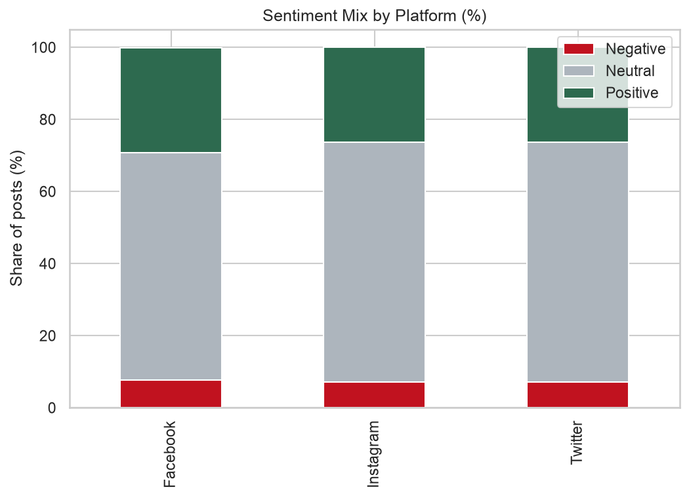
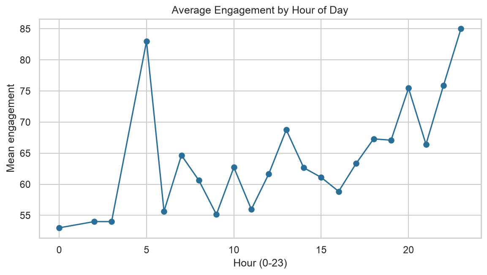
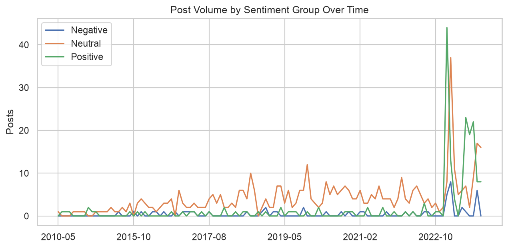

# Social Media Sentiment Analytics

Exploratory analysis of 710 deduplicated social media posts across Twitter/X,
Instagram, and Facebook. The project examines which platforms generate the
most engagement, how sentiment composition varies by platform, and when
audiences are most active.

**Dataset:** [Social Media Sentiments Analysis Dataset (Kaggle)](https://www.kaggle.com/datasets/kashishparmar02/social-media-sentiments-analysis-dataset)  
Download `sentimentdataset.csv` into `data/`. The dataset is not committed to
this repository.

## Key Findings

1. **Instagram has the highest average engagement.** Instagram posts average
   67.92 likes and retweets, compared with 62.55 for Twitter/X and 62.82 for
   Facebook. This means Instagram averages approximately 1.09 times the
   engagement of Twitter/X, the lowest-engagement platform in the sample.

2. **Sentiment is predominantly neutral across all three platforms.**
   Neutral posts account for 63.2% of Facebook posts and 66.5% of both
   Instagram and Twitter/X posts. Facebook has the highest positive share
   at 29.1%, as well as the highest negative share at 7.6%.

3. **Engagement is highest late at night and on Sundays.** Average engagement
   peaks at 23:00, reaching 85.00 likes and retweets per post. Sunday has the
   highest day-of-week average at 67.33, compared with 61.80 on Monday, the
   lowest-performing day.

## Dataset Summary

- **Original rows:** 732
- **Rows after de-duplication:** 710
- **Duplicates removed:** 22
- **Neutral posts:** 465
- **Positive posts:** 193
- **Negative posts:** 52
- **Platforms analyzed:** Twitter/X, Instagram, and Facebook

## Visuals









## Method

- **Cleaning:** stripped whitespace from column names and text values, parsed
  timestamps with invalid values coerced to missing values, and removed
  duplicate records.
- **Derived metrics:** calculated engagement as likes plus retweets and
  extracted hour, day of the week, and month from each timestamp.
- **Sentiment grouping:** mapped the dataset's detailed emotion labels into
  three broader categories: Positive, Negative, and Neutral. The mapping is
  documented in `analysis.py`.
- **Analysis:** compared average engagement by platform, sentiment
  composition by platform, hourly and daily engagement patterns, and monthly
  sentiment trends.

## Project Structure

```text
Social-media-sentiment-analytics/
├── analysis.py
├── requirements.txt
├── README.md
├── data/
│   └── sentimentdataset.csv
└── visuals/
    ├── engagement_by_platform.png
    ├── sentiment_mix_by_platform.png
    ├── engagement_by_hour.png
    └── monthly_sentiment_trend.png
```

## Run It

```bash
pip install -r requirements.txt

# Download the Kaggle CSV and place it at:
# data/sentimentdataset.csv

python analysis.py
```

The script prints the analysis tables in the terminal and saves the generated
charts in the `visuals/` directory.

## Limitations

- The analysis uses a single Kaggle dataset rather than data collected from
  live social-media APIs.
- Engagement is defined only as likes plus retweets and may not capture all
  interaction types available on each platform.
- Engagement metrics are compared across platforms even though interactions
  may function differently on each platform.
- Sentiment labels are supplied by the dataset rather than predicted using a
  sentiment-analysis model developed in this project.
- The findings describe associations within this sample and should not be
  interpreted as proof that posting at a particular time causes greater
  engagement.